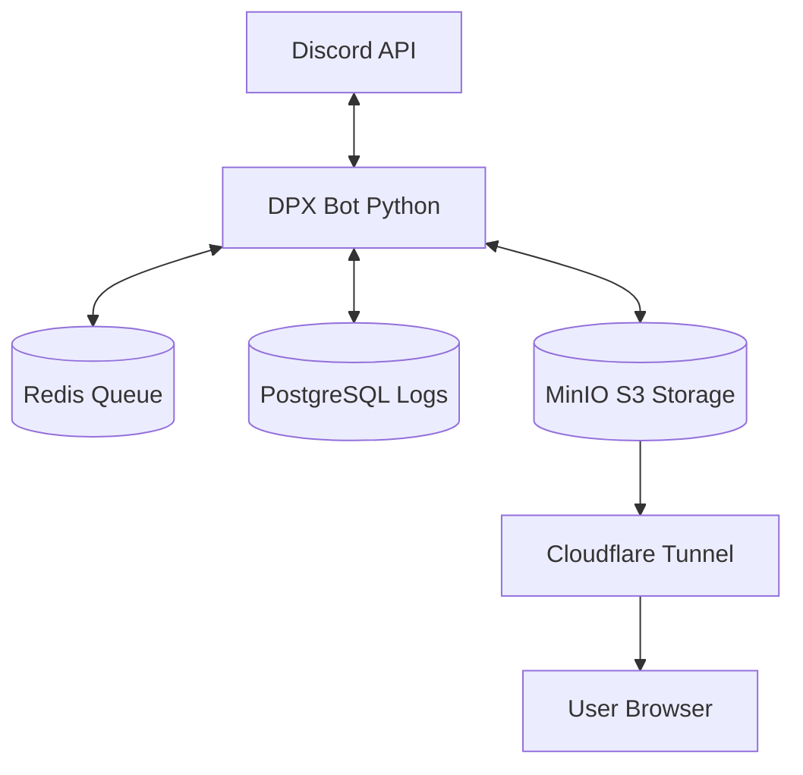

# DPX Discord Bot

[](https://www.docker.com/)
[](https://www.postgresql.org/)
[](https://redis.io/)
[](https://www.cloudflare.com/)

本專案透過容器化架構整合了 PostgreSQL、Redis 與 MinIO，旨在為您的 Discord 伺服器提供一個功能強大、穩定且易於部署的自動化助手。   
即使您是 Windows 使用者，也能透過 Docker 輕鬆部署，不需煩惱 Linux / Python 環境與資料庫安裝。

---

## ✨ 核心功能特色

### 🎵 萬能音樂播放器
- **多平台支援**：支援 YouTube、Bilibili 與 Google Drive 連結。
- **高效隊列**：採用 Redis 記憶體資料庫處理播放隊列。

### 📜 訊息日誌系統
- **文字紀錄**：精確記錄每一則訊息的編輯前後內容與刪除狀態。
- **附件保存**：整合 MinIO (S3) 儲存，被刪除的圖片或檔案會自動同步至本地，並支援在 Discord 內即時預覽與下載。
- **全域大表**：使用 PostgreSQL 高效檢索，即使是數萬則歷史紀錄也能高速翻閱（尚未實作介面）。
- **自動空間管理**：內建30天自動清理機制，過期的附件會自動從雲端移除，無需手動維護硬碟空間。

### 🤖 智慧型新人歡迎
- **隨機多變**：可設定多組標題、訊息、圖片與顏色，Bot 會隨機組合成獨一無二的歡迎卡片。
- **標記支援**：支援 `<user>` 自動標記新成員，讓歡迎訊息更親切且具備高度自定義空間。

### 🛠️ 自動化維護與穿隧
- **免設定外網**：內建 Cloudflare Quick Tunnel，附件下載連結自動生成，無需固定 IP 或買網域。
- **一鍵部署**：不論是 Linux 伺服器還是 Windows 電腦，透過 Docker Compose 即可快速完成搭建。
- **多平台支援**：提供支援 `AMD64` 與 `ARM64` (如 Apple Silicon, 樹莓派) 的映像檔。

---

## 🏗️ 系統架構



---

## 🐧 Linux / 原生環境快速部署

### 1. 取得程式碼
```bash
git clone https://github.com/DeePingXian/DPX_Discord_Bot.git
cd DPX_Discord_Bot
cp .env.example .env
```

### 2. 準備設定
將設定資訊填入 `.env` (參考 `.env.example`)。

### 3. 使用 Docker Compose 部署
您可以選擇從源碼構建，或是直接拉取 GitHub Registery (GHCR) 上的本專案映像檔：

#### 方法 A：從源始程式碼構建
```bash
sudo docker compose up -d --build
```

#### 方法 B：使用預編譯映像檔 (最快)
修改 `compose.yml` 中的 `bot` 服務，將 `build:` 區塊替換為：
```yaml
image: ghcr.io/deepingxian/dpx_discord_bot:latest
```
接著執行：
```bash
sudo docker compose up -d
```

---

## 🪟 Windows 基礎部署教學

如果您是 Windows 使用者，請按照以下步驟操作：

### 1. 安裝環境工具 (只需一次)
- **安裝 WSL (Windows Subsystem for Linux)**：這是運行 Docker 的基礎。
- **安裝 Docker Desktop**：前往 [Docker 官網](https://www.docker.com/products/docker-desktop/) 下載並安裝。安裝過程中若提示使用 WSL 2 引擎，請確保已勾選。
- **啟動 Docker**：進行下一步前，請確保 Docker Desktop 是啟動狀態。

### 2. 下載專案與準備設定
- **下載程式碼**：點擊本頁面右上角的 `Code` -> `Download ZIP`，解壓縮到您偏好的資料夾。
- **建立設定檔**：
    1. 在資料夾中找到 `.env.example`。
    2. 將其重新命名為 `.env`。
    3. 使用「記事本」開啟 `.env`，填入您的 **DISCORD_TOKEN** 與 **LOG_CHANNEL_ID** (Bot 報告頻道)。

### 3. 啟動機器人
1. 在專案資料夾的空白處，按滑鼠右鍵，選擇「**在終端中開啟**」。
2. 輸入以下指令並按 Enter：
   ```powershell
   docker compose up -d --build
   ```
3. **完成！** 您可以關閉視窗了，機器人會自動在背景執行。

---

### 如何確認成功？
回到 Discord，在頻道輸入 `/status`。如果 Bot 回覆了系統狀態，代表大功告成！


---

## 🎮 指令概覽

### 範例圖片均為示意用途，使用時會根據實際情況、程式版本而變化

使用 `/help` 呼叫互動式選單查看詳細指令說明：

| 模組 | 主要指令 | 說明 |
| :--- | :--- | :--- |
| **音樂** | `/play`, `/skip`, `/queue` | 支援 YouTube/BiliBili/Google雲端 來源音訊。 |
| **歷史** | `/history` | 查詢已編輯/刪除訊息，整合圖片預覽與本地下載連結。 |
| **歡迎** | `/welcome_add`, `/welcome_toggle` | 元件化隨機組合歡迎訊息。 |
| **系統** | `/status` | 即時監控三套資料庫與網路穿隧狀態。 |
| **工具** | `/pix`, `/twiu` | 快速產生各站連結。 |

  
  
  
  
  
  
  
  
  
  

---

## 📋 維護與監控

### 常用指令
- **查看 Bot 狀態**：`sudo docker compose ps`
- **查看即時日誌**：`sudo docker compose logs -f bot`
- **重啟 Bot**：`sudo docker compose restart bot`
- **完全重置 (清除所有資料)**：`sudo docker compose down -v`

### 管理介面
- **MinIO 檔案管理**：瀏覽器訪問 `http://localhost:9001` (帳密設定於 .env)
- **PostgreSQL**：運作於 `localhost:5432`


---

## 💾 資料遷移與備份

如果您需要更換主機或備份資料，請參考以下指令：

### 1. 備份 PostgreSQL 文字資料
```bash
# 將所有紀錄匯出為 backup.sql
sudo docker exec -t dpx-db-postgres pg_dumpall -c -U dpx_discord_bot > backup.sql
```

### 2. 備份 MinIO 附件檔案
MinIO 的資料存放在 Docker Volume 中，建議直接打包對應的資料夾：
```bash
# 停止容器後，備份專案目錄下的所有檔案與 Docker Volume
sudo tar -czvf dpx_discord_bot_backup.tar.gz .
```

### 3. 還原資料
在新機器部署完成後，執行：
```bash
# 將備份的 SQL 倒回資料庫
cat backup.sql | sudo docker exec -i dpx-db-postgres psql -U dpx_discord_bot
```

---

## 📝 TODO 發展藍圖

- [ ] **vLLM AI 整合**：連接本地或遠端 vLLM 推論伺服器，讓 Bot 具備強大的語言模型對話能力（已基於本地 Qwen3.5 27B 開發完成，待抽空補全文檔並公開）。
- [ ] **應答機功能回歸**：重構應答機模組，支援直接在 Discord 新增規則並自動同步附件至 S3。
- [ ] **Web 介面回歸**：開發前端控制台，讓管理員能透過網頁更直觀的查看訊息歷史紀錄、編輯應答規則。
- [ ] **多語系支援**：支援多種語言切換。

---

## ⚠️ 注意事項

- **資料持久化**：所有數據皆儲存於 Docker Volumes 中，容器更新不會導致資料遺失。
- **指令同步**：若更新後指令未顯示，請將 Bot 重新邀請入群以強制刷新斜線指令。

---

## 🤝 聯絡與支援

- **開發者**：地平線 DeePingXian
- **討論群組**：若想體驗尚未公開的最新功能、提供建議或回報 Bug，歡迎加入 [DPX Discord Bot 論道堂](https://discord.gg/wJnNm8Fg9e)！
- **授權**：MIT License

---
*本專案由作者於閒暇時間維護，更新緩慢敬請見諒！*
